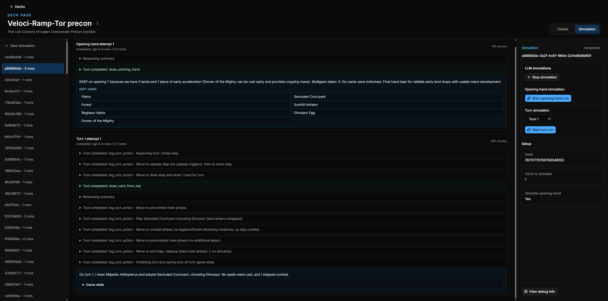

# MTG Auto Goldfish



## Setup

1. Copy the example environment file:

   ```sh
   cp .env.example .env
   ```

2. Fill in the variables in `.env`.

3. Install dependencies:

   ```sh
   npm install
   ```

## Running

Start the app and server in separate terminals:

```sh
npm run dev
```

```sh
npm run server:watch
```

Optionally start ngrok when using openai and locally running mcp server:

```sh
npm run ngrok
```
